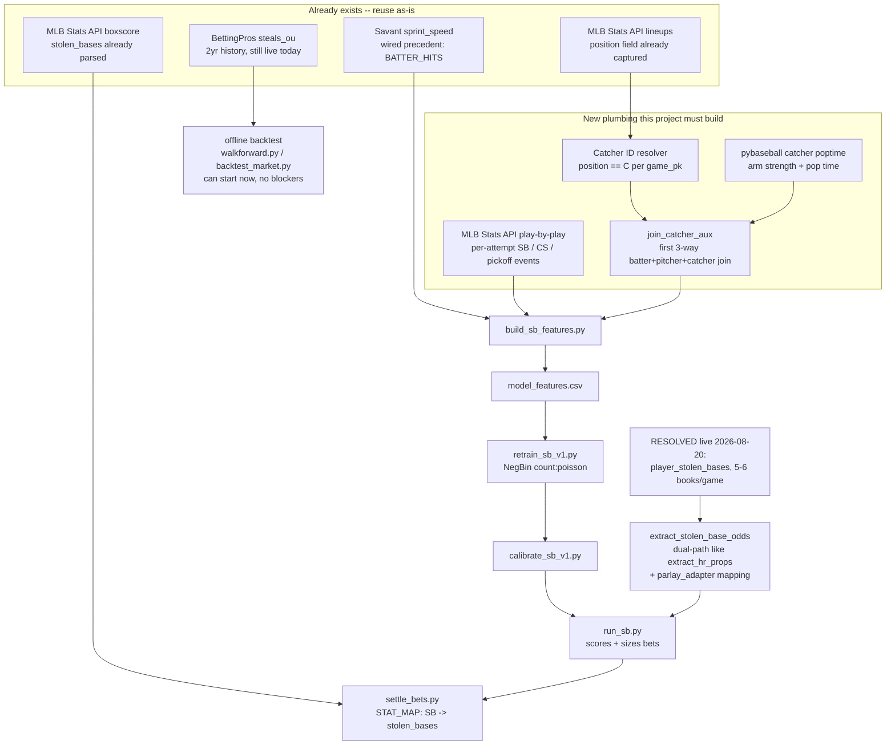

# Scope -- Stolen base ("SB") player-prop model, 2026-08-20

User request: evaluate whether we have the data to build a stolen-base
prediction model (catcher data, sprint speed, pitcher hold/release time, an
on-base/singles component, "any other features that would be helpful"), and
double-check the odds side is actually being pulled. This is a **planning
document only** -- no code was changed this session. Research was done by
4 parallel sub-agents plus live verification (real API calls, real GCS reads)
done directly in this session; both are cited throughout so a future session
can tell "researched" from "personally verified live" apart.

No prior art exists for this: `git log --all --grep` for stolen/catcher/
baserunning/pickoff returns nothing, no branch touches it, `CONCEPTS.md` has
no baserunning vocabulary yet, and `mlb_core/registry.py` has no `"SB"` entry
-- this is genuinely greenfield, not a resume of abandoned work.

## TL;DR verdict

**Buildable, but it is two projects wearing one name.** Track 1 (odds +
settlement plumbing) is nearly free -- most of the pieces already exist, and
as of this update **the single biggest risk on that track is resolved (see
below)**. Track 2 (the model itself) needs two genuinely new things this
codebase has never built before: a **catcher join** (no system today joins a
third player-entity) and a **new data source** for granular stolen-base
events, because live testing this session proved the existing Statcast
pipeline structurally cannot see them. Budget real time for Track 2; don't
treat it as a config-fill exercise like adding a tenth market to an existing
model shape.

**UPDATE (same day, live-probed): ParlayAPI does carry a stolen-base
market, confirmed live against tonight's real slate.** The market key is
`player_stolen_bases` -- **not** documented on parlay-api.com's public docs
page (which was checked first and suggested it might not exist), but
present and actively quoted when queried directly against the provider's own
live markets-catalog endpoint and a real event. This directly de-risks the
one finding that was flagged as this plan's biggest open question. Full
detail in the new s1a below; the rest of this document is otherwise
unchanged from the original scope. Independent of this, real historical
odds already sit in GCS today and a walk-forward backtest of the model can
start immediately.

---

## 1. What already exists today (verified this session)

| # | Capability | Status | Evidence |
|---|---|---|---|
| 1a | **Settlement** (grading a real stolen-base bet vs. the final box score) | **Free -- zero new code** | `mlb_core/data/game_result.py:220` already parses `"stolen_bases": int(bat.get("stolenBases", 0))` from the real MLB Stats API boxscore, in the same per-batter dict every other prop settler reads. `caughtStealing` is not pulled alongside it yet (one-line addition if needed). |
| 1b | **Historical odds for backtesting** | **Confirmed live, richer than expected** | BettingPros market id `294` ("steals") has been backfilled into `Odds/history/market=steals_ou/` since **2024-04-01**. `coverage_report()` read live this session: `{"n_dates": 508, "first": "2024-04-01", "last": "2026-06-29", "per_season": {"2024": 203, "2025": 208, "2026": 97}}`. |
| 1c | **Live odds for this market, TODAY** | **Confirmed live, separate feed** | The historical backfill archive (`Odds/bettingpros/steals/*.csv`) stops 2026-06-29, but `Odds/history/market=steals_ou/` partitions continue **through 2026-08-20** -- verified via `gsutil ls`. This is `mlb.runners.track_bettingpros` (the intraday BettingPros tracker), a second, still-running pipeline into the same analytics store. It is **not** read by any live scoring runner today (all 10 runners score off the ParlayAPI/SGO snapshot, not `odds_history`). |
| 1d | **Real market depth/coverage** | **Confirmed live -- not a thin market** | Pulled and inspected the 2026-08-19 partition directly: 73,302 rows, 15 games, **11 books** (consensus, hardrock, betmgm, partycasino, fliff, fanduel, thescore, draftkings, fanatics, betrivers, sugarhouse). Line is 0.5 in 73,293/73,302 rows (a handful of 1.0/1.5 alt lines already appear organically). **All 117 players DraftKings quoted that day had BOTH Over and Under priced** -- a genuine two-sided market, unlike BATTER_K's non-overlapping book split (see s6). `fair_prob` is only populated on 53,438/73,302 rows -- a data-quality gap worth checking before trusting it at face value. |
| 1e | **Sprint speed** | **Already flowing, already precedented** | Baseball Savant's `sprint_speed` leaderboard (ft/sec, 2015+) has been one of six nightly-refreshed Savant datasets since before this session (`mlb_core/data/savant_leaderboards.py`). Commit `4a0545c` already wired it into BATTER_HITS as `sprint_speed_ft_sec` (exact-year -> prior-year fallback -> league-median-fill join). This is the direct template to copy. |
| 1f | **Catcher arm strength / pop time** | **Available via an already-installed, already-imported dependency, unused today** | `pybaseball==2.2.7` is pinned in `requirements.txt` and already imported in `auxiliary_features.py` (for B-Ref pitching). **Live-fetched this session** (`pybaseball.statcast_catcher_poptime(2025)`): 84 catchers, columns `entity_name, entity_id (MLBAM ID), team_id, age, maxeff_arm_2b_3b_sba, exchange_2b_3b_sba, pop_2b_sba_count, pop_2b_sba, pop_2b_cs, pop_2b_sb, pop_3b_sba_count, pop_3b_sba, pop_3b_cs, pop_3b_sb`. Real arm-strength (`maxeff_arm_*`), exchange time, and separate pop-time-on-caught-stealing vs. pop-time-on-successful-steal splits, keyed on MLBAM ID -- lines up cleanly with every other player-ID join in this codebase. `pybaseball.statcast_catcher_framing()` also exists if framing is ever wanted (secondary signal, not in the v1 feature list below). |
| 1g | **Catcher identity (who's behind the plate today)** | **Raw material exists, resolver does not** | `mlb_core/data/lineups.py:137` already captures a per-player `position` field from the MLB Stats API lineup pull (e.g. `"C"`), but nothing anywhere filters on it to answer "who is today's starting catcher for team X." Small new function, not new data. |
| 1h | **Granular stolen-base / caught-stealing / pickoff EVENTS** | **NOT available from this repo's existing Statcast pipeline -- verified live, see s2** | This is the one finding that changes the shape of the plan. See below. |
| 1i | **ParlayAPI (the actual live production odds feed)** | **Genuinely unknown -- needs a live probe** | `parlay_adapter.py`'s `PROP_MARKET_MAP` and `nba/config.py`'s `PARLAY_PROP_MARKETS["baseball_mlb"]` list exactly 6 markets (HR, K, outs, hits, total bases, earned runs) -- each annotated "verified against a live payload" on the date it was added. Stolen bases was simply never asked for; its absence is not evidence it doesn't exist on ParlayAPI's side. This needs a real probe, not more code reading (see Phase 0). |
| 1j | **A direct cautionary precedent: BATTER_K** | **Confirmed, in CONTEXT.md** | A fully-built odds-extraction + settlement + Discord + frontend path was shipped and then abandoned before any model work began, purely because DraftKings only had Over prices and BetMGM only had Under prices for strikeout props -- zero overlapping pairs. No feature builder or model file for BATTER_K exists anywhere. **Finding 1c above already substantially de-risks this for the BettingPros feed** (real two-sided DK coverage confirmed), and **finding 1a below now clears it for ParlayAPI too**. |

### 1a. ParlayAPI live probe -- RESOLVED (live-verified same day)

**Checked docs first, then verified live -- and the docs were wrong/stale.**
`WebFetch` against `parlay-api.com/docs` listed 16 MLB player-prop market
keys and did **not** include anything stolen-base-related, which looked like
a negative signal. Rather than trust a static docs page (this repo's own
convention is "verified against a live payload," not "verified against
docs"), I called the provider's own live markets-catalog endpoint directly:

```bash
GET https://parlay-api.com/v1/sports/baseball_mlb/props/markets
```

This is a metadata endpoint (not in the credits table, effectively free) that
returned **1,538 real market keys** with live bookmaker lists and historical
snapshot counts. Six of them are stolen-base variants:

| Market key | Label | Bookmakers | Snapshots |
|---|---|---|---|
| **`player_stolen_bases`** | stolen_bases | bet365, betmgm, **bovada**, caesars, draftkings, fanatics, fliff, novig, prizepicks, sleeper, underdog (11) | 1,815 |
| `player_player_to_record_a_stolen_base` | Player to record a Stolen Base | bovada only | 2,397 |
| `player_stolen_bases_alt` | "...Milestones 1 Or More" (alt-line ladder) | caesars, draftkings, fanduel | 604 |
| `player_stolen_bases_milestones` | Stolen Bases Milestones | draftkings only | 37 |
| `player_combined_batter_stolen_bases` | Combined Batter Stolen Bases (2-player combo) | draftkings only | 28 |
| `player_either_batter_stolen_bases` | Either Batter Stolen Bases (2-player combo) | draftkings only | 20 |

**`player_stolen_bases` is the one to build against** -- it matches this
repo's existing `player_X` naming convention exactly (same shape as
`player_hits`, `player_total_bases`, etc. already in `PROP_MARKET_MAP`), and
carries the deepest, most standard book coverage.

**Then confirmed it's actually live, right now, on a real game** -- not just
present in a historical catalog. Pulled today's real slate
(`GET /v1/sports/baseball_mlb/odds?markets=h2h`, 8 real games, 2026-08-20)
and queried `player_stolen_bases` for Yankees @ Orioles
(`GET /v1/sports/baseball_mlb/events/{id}/odds?markets=player_stolen_bases`).
Real result, **6 bookmakers responding on this one game right now**:

```
draftkings: 12 outcomes (6 players, Over/Under paired), e.g.
    Over Colton Cowser 0.5  ->  +800
    Under Colton Cowser 0.5 -> -1440
fliff:    4 outcomes, Over/Under paired
bet365:   6 outcomes, Over/Under paired (one templated/unfilled
          placeholder outcome also present -- see gotcha below)
bovada:   7 outcomes, one-sided "Yes" shape, no Over/Under pairing
caesars:  2 outcomes, one-sided "Yes" shape
novig:    3 outcomes, one-sided "Yes" shape
```

Of these, `bovada` is on this repo's `OFFSHORE_BOOKS` denylist and would
already be excluded by existing best-book logic unchanged. The remaining 5
(draftkings, fliff, bet365, caesars, novig) all qualify as onshore today --
FanDuel and BetMGM simply hadn't posted this specific prop for this specific
game at query time, which matches the well-documented timing pattern already
noted elsewhere in this repo (props post gradually through the afternoon).

**Two real implementation gotchas surfaced by this live data, not
theoretical ones:**

1. **The market ships in two different shapes across books, not one.**
   `draftkings`/`fliff`/`bet365` quote a genuine two-sided Over/Under at
   `point=0.5`. `bovada`/`caesars`/`novig` quote a one-sided "Yes" price with
   no complementary "No"/Under side at all. This means a real
   `extract_stolen_base_odds()` needs **the same dual-path handling
   `extract_hr_props()` already implements** (yn-yes primary path +
   ou-over-at-0.5 fallback path) -- it is **not** a drop-in call to the
   shared `_extract_player_ou_props()` helper the way `extract_batter_hits_odds()`/
   `extract_batter_tb_odds()` are, since that helper assumes every book quotes
   both sides. Revise the build-list entry in s5 accordingly.
2. **At least one book's feed contains unresolved template placeholders.**
   `bet365` returned one outcome literally named
   `"Over {optionTypeAbbr}{value} SB"` alongside otherwise valid, real
   player-named outcomes in the same response -- a bad/unsubstituted string
   from bet365's own upstream feed, not a bug in this repo's code (there is
   no such code yet). A real extractor must defensively skip outcomes whose
   name/description still contains an unresolved `{...}` template.

**Credit cost of this whole probe: ~2-3 credits** (the markets-catalog call
is free; `get_slate`-equivalent and the one `get_event_props`-equivalent call
are ~1 credit each per this client's own documented pricing) -- negligible
against the free tier (1,000/mo) or the production ceiling (19,500/mo). SGO
was not checked, per the user's own instruction to treat it as a fallback --
it wasn't needed.

### 2. The Statcast finding, in detail (this changes the plan)

The working assumption going in (and what the research sub-agent initially
reported, appropriately hedged as unverified) was that `statcast_master.csv`'s
`events` column probably contains `stolen_base_2b`, `caught_stealing_2b`,
`pickoff_1b`, etc., since these are real, documented Statcast values, and the
only open question was whether this repo's own PA-level dedup would
inadvertently collapse them away.

**That assumption is wrong, and it's worse than a dedup problem.** Live-fetching
4 real days (2026-08-15 through 2026-08-18, ~56 games, ~17,000 raw pitch rows)
using this repo's exact production URL from `mlb_core/data/statcast.py`
(`statcast_search/csv`, `type=details`, `player_type=pitcher`) turned up
**zero** stolen-base/caught-stealing/pickoff values anywhere in `events` --
only genuine plate-appearance-ending outcomes ever appear (`field_out`,
`strikeout`, `single`, `double`, `triple`, `home_run`, `walk`, `hit_by_pitch`,
`sac_fly`, `sac_bunt`, `double_play`, `grounded_into_double_play`,
`fielders_choice(_out)`, `intent_walk`, `field_error`, `catcher_interf`,
`strikeout_double_play`, `truncated_pa` -- 19 distinct values total across the
sample). An A/B test removing/varying `group_by` produced byte-identical row
counts across all three variants, so the query's `group_by=name` parameter is
**not** the cause (ruling out the theory in `docs/solutions/logic-errors/
statcast-master-pa-level.md`, which speculated `group_by` was the likely root
cause without confirming it). Something else in this exact query's fixed
parameters restricts results to AB-terminal events only.

**The good news: the data exists, just not from this pipe.** A direct
cross-check of the MLB Stats API's `/api/v1.1/game/{game_pk}/feed/live`
endpoint (already used elsewhere in this repo -- `game_result.py`,
`mlb_core/data/scoring.py`, `mlb_core/data/lineups.py` all call MLB Stats
API) against a real game (`game_pk=824397`, 2026-08-16) returned a clean,
structured play:

```json
{
  "event": "Caught Stealing 2B",
  "eventType": "caught_stealing_2b",
  "description": "Jose Ramirez caught stealing 2nd base, catcher Freddy Fermin to second baseman Jake Cronenworth.",
  "inning": 1, "halfInning": "bottom",
  "pitcher": "Casey Mize"
}
```

This is real, per-attempt data with the pitcher on the mound already resolved
(`matchup.pitcher`) and the catcher's name embedded in the free-text
description. One wrinkle: the structured `runners[].runner` sub-field was
`null` on this example, so the attempting runner's identity needs to come
from the description text (regex) or be cross-referenced against the batter
at the plate / base-out state at the time -- a parsing detail, not a blocker.

**Implication for the plan:** any feature needing real stolen-base attempt
counts, success rates, or "pitcher's SB-against rate while somebody's on
base" must be built from a **new MLB Stats API play-by-play ingestion**, not
by extending `statcast_master.csv`. This is a new module, not a column
addition -- see s4.

---

## 3. Recommended architecture: NegBin count model (BATTER_HITS shape)

Two existing templates in this codebase:

- **HR-style binary classifier**: `binary:logistic`, one-sided `yn-yes`
  market, `devig_unilateral`. Fits a market that is inherently "yes/no."
- **BATTER_HITS/BATTER_TB-style NegBin count model**: `count:poisson`
  regressor -> lambda -> NegBin CDF against a two-sided O/U line,
  `devig_two_way`, plus the existing 2+/3+ alt-line sub-market machinery
  (`mlb_core.risk.threshold_bets.score_threshold_bet()`) for free.

**Recommendation: the NegBin/count shape.** Two reasons converge:

1. **The market itself is genuinely two-sided O/U**, not one-sided yes/no --
   confirmed live in finding 1c (Over AND Under both priced, at real prices,
   for every DK player checked). Modeling it as a count and deriving
   `P(SB >= 1) = 1 - CDF(0)` is the more natural fit, and it comes with the
   N+ alt-line pattern already built for K/OUTS/BATTER_TB/BATTER_HITS.
2. **Multi-steal games matter proportionally more here than multi-HR games
   do for HR.** A speedy leadoff hitter attempting 2-3 steals in a game is a
   real, non-negligible tail; collapsing to a binary "did he steal at least
   once" throws that away. This is exactly why BATTER_HITS/BATTER_TB, not
   HR, were built as NegBin in the first place -- HR stayed binary
   specifically because its market is one-sided.

**The one thing neither template solves: stolen bases need a gating
opportunity first.** BATTER_HITS/BATTER_TB/HR all implicitly treat "the game
happened" as the opportunity (every batter gets plate appearances by
default). A stolen base requires the batter to first reach base via a
single/walk/HBP/error, then be held at 1B or 2B with the next base open, and
only then can an attempt occur. None of the three existing count/binary
models have this two-stage structure. **For v1, the practical answer is not
to build a literal two-stage/hurdle model** (real research, no existing
skeleton to copy) **but to fold opportunity signal into the feature set
directly** -- on-base rate, single rate, and lineup slot all proxy "how often
does this player even get the chance" the same way BATTER_HITS's BABIP/contact
features proxy "quality of contact" without an explicit two-stage model. Flag
an explicit hurdle model as a v2 idea if the v1 count model's calibration
looks off in a way that traces back to zero-inflation.

**A cheaper fallback exists if you want to ship something faster**: since the
market is ~99.99% quoted at the 0.5 line in practice, an HR-style binary
"P(batter steals >= 1 base)" classifier is nearly behaviorally equivalent day
to day, at meaningfully lower engineering cost (no NegBin CDF/`nb_alpha`
fitting). The cost is discarding the 2+ SB tail and the natural N+ alt-line
extension. Worth knowing about, not the recommendation.

---

## 4. Feature catalog

Every row is tagged with its real status, not aspirational status.

### Runner (batter) ability, speed, and on-base component

The user's instinct here is exactly right and worth stating precisely: a
runner has to reach base a specific way to have a stealing opportunity at
all. A **single, walk, or HBP** typically leaves the runner on 1B, well
positioned to attempt 2B. A **double or triple bypasses that opportunity
entirely** by taking 2nd/3rd immediately. So "on-base ability" for this model
means singles/walks/HBP rate specifically, not just batting average or slugging.

| Feature | Source | Status |
|---|---|---|
| `sprint_speed_ft_sec` | Savant `sprint_speed` leaderboard | **Exists** -- copy the BATTER_HITS join verbatim |
| `sb_L20` / `sb_L50` / `sb_season` (successes) | `game_result`-style boxscore stat, rolled | **Exists** (boxscore stat already parsed; needs a rolling-feature builder, same shape as every other `_LN` rolling stat in this repo) |
| `sb_attempt_rate_L20`, `cs_rate_L20`, `sb_success_pct_L50` | New play-by-play ingestion (s2) | **New -- needs the new MLB Stats API play-by-play module** |
| `times_on_base_L20` (H + BB + HBP, i.e. reach-base rate) | Statcast `events` (existing whitelist already includes `single`/`walk`/`hit_by_pitch` as terminal PA events -- these DO survive the existing pipeline, unlike SB/CS/PK) | **Exists** -- straightforward new aggregation on data already flowing |
| `single_rate_L20`, `bb_rate_L20`, `hbp_rate_L20` (opportunity-generating events specifically, as distinct from XBH which end the opportunity) | Same as above | **Exists** |
| `k_rate_L20` (strikeouts reduce on-base chances) | Reuse from BATTER_HITS's existing pattern | **Exists** |
| `ewma_batting_order` (leadoff/2-hole hitters attempt more; also more PAs/opportunities) | Existing shared feature, reuse as-is | **Exists** |
| `stand` (batter handedness -- lefties start marginally closer to 1B) | Statcast, already whitelisted | **Exists** |
| `sb_career_rate`, age-adjusted speed trend | Derivable from rolled/season aggregates above | **Exists (derived)** |

### Opposing catcher (genuinely new to this codebase)

| Feature | Source | Status |
|---|---|---|
| Today's starting catcher, opposing team | `lineups.py`'s existing `position` field | **New (small)** -- a resolver function, not new data |
| `catcher_pop_2b_sba`, `catcher_maxeff_arm_2b_3b_sba`, `catcher_exchange_2b_3b_sba` | `pybaseball.statcast_catcher_poptime()` -- **verified live this session**, real columns above | **New -- moderate lift** (wrap with the same GCS nightly/backfill scaffolding `auxiliary_features.py` already gives B-Ref pitching) |
| `catcher_cs_pct_allowed_L50/season` (caught-stealing rate against) | Either derivable from the pop-time leaderboard's own `pop_2b_cs`/`pop_2b_sb` split, or from the new play-by-play ingestion joined by catcher identity | **New**, two possible sources, prefer the poptime leaderboard first (cheaper) |
| Catcher framing | `pybaseball.statcast_catcher_framing()` | **Exists if wanted, low-priority** -- weak/secondary signal for base-stealing specifically, skip for v1 |

### Opposing pitcher

| Feature | Source | Status |
|---|---|---|
| `p_throws` (LHP has a real, well-documented hold advantage facing 1B) | Statcast, already whitelisted, already joined elsewhere | **Exists** |
| Pitcher SB-against rate while pitching with a runner on | New play-by-play ingestion (needs `on_1b`/`on_2b` base-state context, which the existing Statcast pipeline DOES retain even though it can't see the SB event itself -- so this genuinely needs the new MLB Stats API source, not a Statcast patch) | **New** |
| SB/CS allowed as a standard B-Ref pitching stat | `auxiliary_features.py` already calls `pybaseball.pitching_stats_bref()` for FIP/WHIP/SO9/BB9 -- Baseball-Reference's standard pitching page also carries `SB`/`CS` allowed columns in the same already-fetched dataframe | **Likely exists already, unconfirmed this session** -- cheap to check: this may just be 2 more columns kept from a call this repo already makes every night |
| "Time to the plate" / pickoff-move timing | Baseball Savant's public interface | **Confirmed NOT available.** No such field exists in `STATCAST_FIELDS`, in any of pybaseball's ~30 wrapped leaderboards, or anywhere in Baseball Savant's public CSV/leaderboard surface as far as this investigation can determine. This is reportedly captured by MLB's internal Hawkeye system but not published. **Practical substitute: the pitcher's own SB-attempts-against and SB-success-against rate (above) is a better-grounded proxy anyway** -- it's the outcome-integrated version of exactly what "slow to the plate" is trying to measure, sourced from data that already exists once the play-by-play ingestion is built, not a synthetic number. |

### Situational / regime

| Feature | Source | Status |
|---|---|---|
| `post_pitch_clock` (2023-03-30 regime flag) | Existing shared pattern, copy verbatim | **Exists, and matters more here than elsewhere.** The pitch-clock rule change (disengagement limits, bigger bases) is explicitly called out in this repo's own NRFI builder comment as something that "changed SB success materially" -- worth considering restricting v1 training data to 2023+ only rather than just flagging pre/post, given how large the real-world rule effect was specifically on stolen bases (bigger than its effect on the metrics the flag was originally added for). |
| Park/turf, weather, day/night | Existing weather/park joins | **Exists, likely marginal** -- reuse if cheap, don't prioritize |
| Score differential / inning ("garbage time" suppresses attempts) | Not currently computed pre-game anywhere | **Out of scope for v1** -- this is a same-game, in-play signal, not a pregame feature; relevant only if this ever becomes a live/in-play model, which is not what's being scoped here |

---

## 5. New data plumbing this project must build



### File-by-file build list

| File | Change | Precedent to copy |
|---|---|---|
| `mlb_core/data/game_result.py` | Add `"caught_stealing": int(bat.get("caughtStealing", 0))` next to the existing `stolen_bases` line | Same file, one line up |
| **NEW** `mlb_core/data/baserunning.py` (or extend `game_result.py`) | Pull `liveData.plays.allPlays` from `/api/v1.1/game/{game_pk}/feed/live`, filter `result.eventType` in the SB/CS/pickoff set, emit one row per attempt with game_pk/inning/half/pitcher/description (parse runner+catcher from description text where the structured field is null) | `mlb_core/data/scoring.py`'s per-game loop pattern |
| `mlb_core/data/auxiliary_features.py` | Add `_fetch_catcher_poptime()` wrapping `pybaseball.statcast_catcher_poptime()`, `load_catcher_poptime()`, wire into `auxiliary_features_nightly_gcs()` | `_fetch_fangraphs_pitching()` (same "call pybaseball directly" pattern, same file) |
| **NEW** catcher-identity resolver | Small function using `lineups.py`'s existing `position` field to pick the "C" per team per game_pk | n/a, genuinely new but small |
| `mlb_core/data/aux_joins.py` | **NEW** `join_catcher_aux()` -- first 3-way join in this codebase (batter + opposing pitcher + opposing catcher in one row) | Structurally similar to `join_batter_aux()`, but nothing to literally copy -- this is the one real "new join type" |
| `mlb_core/odds/sgo.py` | **NEW** `extract_stolen_base_odds()` -- **confirmed this needs `extract_hr_props()`'s dual-path pattern (yn-yes + ou-over-at-0.5 fallback), not a 3-line delegate to `_extract_player_ou_props()`** -- live data shows some books (bovada, caesars, novig) quote one-sided "Yes" only, others (draftkings, fliff, bet365) quote real two-sided O/U. Also needs a defensive skip for unresolved `{...}` template outcomes (seen live from bet365). | `extract_hr_props()`'s dual yn-yes/ou-fallback structure, not the simpler batter_hits/batter_tb pattern |
| `mlb_core/odds/parlay_adapter.py` | **NEW** `PROP_MARKET_MAP` entry: `"player_stolen_bases": ("batting_stolenBases", "batting_stolenBases", "ou")` -- **confirmed live, ready to add** | Existing dict, same shape |
| `nba/config.py` | Add `"player_stolen_bases"` to `PARLAY_PROP_MARKETS["baseball_mlb"]` -- **confirmed live, ready to add** | Existing list |
| `mlb/runners/settle_bets.py` | Add `"SB": "stolen_bases"` to `_settle_batter_props()`'s `STAT_MAP` | Same pattern as every other batter prop |
| `mlb_core/registry.py` | New `SystemConfig` entry, `tune_objective="count:poisson"`, `tune_metric="poisson-nloglik"` | BATTER_HITS's entry, near-verbatim |
| **NEW** `mlb/systems/SB_Pro_System/config_sb.py` | Explicit `SB_FEATURES` list (see s4) + betting params | `BATTER_HITS_System/config_batter_hits.py`, near-verbatim structure |
| **NEW** `mlb/runners/build_sb_features.py` | Feature builder | `build_batter_hits_features.py` structure, new catcher join added |
| **NEW** `mlb/runners/run_sb.py` | NegBin CDF vs. line, `devig_two_way`, **the BATTER_HITS lineup discipline is non-negotiable here**: no historical-team fallback when lineups aren't posted, hard-skip on non-comparable `event_id`/`game_pk` (BATTER_HITS's exact fix for the 2026-06 $933 fake-P&L incident) | `run_batter_hits.py`, near-verbatim scoring flow |
| **NEW** `mlb/training/retrain_sb_v1.py`, `calibrate_sb_v1.py` | Full retrain/calibrate pair | `retrain_batter_hits_v1.py` / `calibrate_batter_hits_v1.py` |
| `mlb_core/schemas.py` | New `sb_model_features` schema entry | Existing `batter_hits_model_features` entry |
| `mlb_core/rationale.py` | New `_SB_RULES` list | `_BATTER_HITS_RULES` |
| `mlb/runners/monitor_drift.py` | Add SB to `SYSTEM_CONFIG` -- **not auto-populated from the registry, a documented gotcha (finding C6.4) that has already bitten 3 systems** | Existing entries |
| `mlb/training/tune_hyperparams.py` | Add SB to `SYSTEM_CONFIG` -- also hand-maintained, also not auto-populated | Existing entries |
| `main.py` | `VALID_SYSTEMS`, builders dict, `_run_system`, `build_features_handler`, dashboard list, reset-and-run list -- **still hardcoded** (E13 backlog item, not yet migrated to the registry) | Every other system's entries |
| `tests/test_sgo_extractors.py` | New fixture entries + `test_extract_stolen_base_odds()` | Template already exists per-extractor |
| `tests/test_settlement.py` | New settlement test class | `TestSettleEv` (most recent example, same file) |
| `CONTEXT.md` | Full update per its own s18 checklist -- **only once actually implemented**, not part of this scoping session | s1/s2/s3/s5/s10 tables |

---

## 6. Phase 0 -- de-risking spikes (do these before feature engineering)

| # | Spike | Why | Cost |
|---|---|---|---|
| 1 | ~~**Live-probe ParlayAPI** for a stolen-base market~~ | **Done, same session as a same-day follow-up (user requested it directly).** Confirmed live: `player_stolen_bases`, 11 catalog books, 5-6 live-quoting on a real checked game. See s1a. | ~2-3 credits spent |
| 2 | **Book-pairing coverage check** | Substantially cleared for both feeds now: BettingPros (finding 1c, 117/117 DK players two-sided) and ParlayAPI (finding 1a, 5 onshore books live on one real game, though mixed one-sided/two-sided shape across books -- see the two gotchas in s1a). Low remaining risk; worth re-checking across a few more games before writing the extractor, but no longer an open unknown. | Cheap, code-only |
| 3 | ~~Verify statcast/MLB Stats API data availability~~ | **Done this session** -- see s2. No need to redo. | -- |
| 4 | Confirm whether B-Ref's standard pitching stats (already pulled nightly) include `SB`/`CS` allowed columns | Could make the "pitcher SB-against" feature nearly free instead of requiring the new play-by-play ingestion for that one feature | Cheap, one inspection of an existing dataframe |

---

## 7. Rollout plan

Follows this repo's standing conventions, no deviation proposed:

1. Build feature pipeline + offline backtest first, against the **already-available** 2024-04-01-to-present BettingPros `steals_ou` history in `odds_history` -- this can start regardless of how Phase 0 resolves, since it doesn't touch live scoring.
2. Evaluate the backtest on **CLV, not ROI**, per this repo's own hard-won rule (`docs/solutions/logic-errors/backtest-roi-vs-clv-soft-line-artifact.md`): positive ROI against a soft historical line with flat/negative CLV means "beating a stale line," not "real edge." None of the 6 systems checked in the 2026-06-30 sweep cleared this bar; don't assume SB will either.
3. Ship live as `LOG_ONLY = True` (module-level flag, BATTER_HITS's pattern), `kelly_triggered` always structurally False, full prediction logging from day one.
4. Wire into `mlb-fit-calibrators` (the realized-outcome prediction calibrator, separate from the training-time isotonic calibrator -- both layers, per `docs/solutions/conventions/retrain-calibrate-sequence.md`) and `EDGE_CAP` from the start, not as an afterthought.
5. 200-settled-bet paper gate before promoting off `LOG_ONLY`, same criteria as every other system (CONTEXT.md s6).

---

## 8. Risk register / open decisions

| Risk | Severity | Mitigation / decision needed |
|---|---|---|
| ~~ParlayAPI may not carry this market at all~~ | **RESOLVED** | Confirmed live 2026-08-20 (s1a): `player_stolen_bases`, 11 catalog books, 5-6 live on a real checked game. No longer blocks live sizing. |
| The market ships in two incompatible shapes across books (two-sided O/U vs. one-sided "Yes") | **Medium -- new, real** | `extract_stolen_base_odds()` must copy `extract_hr_props()`'s dual-path structure, not the simpler `_extract_player_ou_props()` helper every other O/U prop extractor uses. Also must defensively skip unresolved `{...}` template outcomes (seen live from bet365). See s1a for the exact live evidence. |
| Catcher join is genuinely new infrastructure | Medium | Scoped and templated above (s5); real work, not a blocker, budget accordingly |
| Pitcher "time to plate" is not publicly available | Low (substitute exists) | Use pitcher SB-against rate (s4) instead -- arguably better signal anyway |
| `post_pitch_clock` may understate the 2023 rule change's real effect on SB specifically | Medium | Consider training on 2023+ only as an explicit experiment, not just the binary flag every other model uses |
| BettingPros `fair_prob` only ~73% populated in the sample checked | Low | Verify/backfill before trusting devigged probabilities from this feed in a backtest |
| Two-stage opportunity structure has no existing skeleton | Medium (modeling risk, not plumbing risk) | v1: fold into features, not architecture (s3). Revisit as a real hurdle model only if v1 calibration shows a specific zero-inflation problem |
| `monitor_drift.py` / `tune_hyperparams.py` SYSTEM_CONFIG entries are easy to forget | Low | Both are explicitly called out in s5's build list; this has bitten 3 prior systems for months each |

---

## Appendix -- verification performed this session (for reproducibility)

- `gsutil cat gs://concrete-crow-445205-m4-mlb-data/Odds/history/_coverage/steals_ou.json` -- coverage report (finding 1b)
- `gsutil ls gs://concrete-crow-445205-m4-mlb-data/Odds/history/market=steals_ou/` and `Odds/bettingpros/steals/` -- confirmed the live-vs-historical-archive split (finding 1c)
- Downloaded and inspected `market=steals_ou/date=2026-08-19/part-0.parquet` directly with pandas -- row/book/line/selection distributions, DK two-sided coverage check (finding 1d)
- Live-fetched Baseball Savant's `statcast_search/csv` for 2026-08-15 through 2026-08-18 using this repo's exact production URL/headers from `mlb_core/data/statcast.py`, inspected the full `events` vocabulary, and A/B-tested 3 `group_by` variants against an identical date (finding on Statcast's gap, s2)
- Live-fetched MLB Stats API `/api/v1/schedule` + `/api/v1.1/game/{game_pk}/feed/live` for a real 2026-08-16 game and located a real `caught_stealing_2b` play with full context (finding on play-by-play, s2)
- Live-called `pybaseball.statcast_catcher_poptime(2025)` and inspected real returned columns (finding 1f)

**Same-day follow-up (user-requested): live ParlayAPI probe (finding 1a).**
`WebFetch` against `parlay-api.com/docs` first (found nothing, docs turned
out to be incomplete). Then, using the `parlay-api-key` Secret Manager value
(read via `gcloud secrets versions access`, piped directly into a single
`curl` call, never written to disk or printed):
- `GET /v1/sports/baseball_mlb/props/markets` -- the live markets catalog (free), found 6 stolen-base-related keys
- `GET /v1/sports/baseball_mlb/odds?markets=h2h` -- today's real 8-game slate, to get a live event_id
- `GET /v1/sports/baseball_mlb/events/{id}/odds?markets=player_stolen_bases` -- real live props for Yankees @ Orioles, 2026-08-20, confirming 6 responding bookmakers with real prices

All of the above are read-only calls (public Savant/MLB Stats API endpoints,
`gsutil` read against this project's own bucket, and the ParlayAPI probe
using the project's own already-provisioned key for its intended purpose) --
no production data was written, no secrets were persisted to disk or
printed, and total ParlayAPI credit spend was on the order of 2-3 credits
against a 1,000/mo free-tier or 19,500/mo production ceiling.
